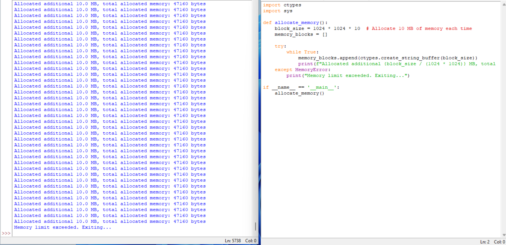
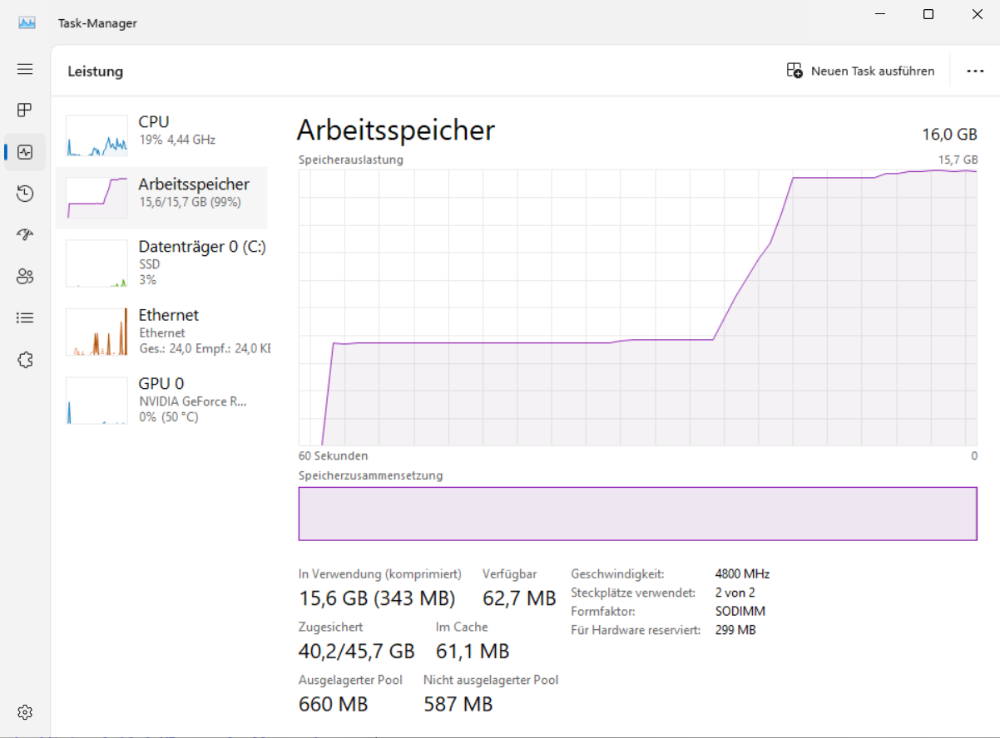

# Ram Hog (Memory Tester)

This Python script is designed to continuously allocate memory in 10 MB blocks until the system runs out of memory. 
It is useful for testing how an application or system handles low-memory conditions.

## Features

- Continuously allocates memory in 10 MB blocks
- Prints the total allocated memory until the system runs out of memory
- Exit when memory limit is exceeded
  
  
  

## Important Considerations

- Resource Usage: This program will consume significant system resources and can potentially make the
system unstable or unresponsive. Use it with caution.

- Permissions: Ensure you have the necessary permissions and are running it in an environment where such resource
usage is allowed and won't cause issues for other users or applications.

- Testing Environment: Preferably run this type of program in a controlled environment, 
such as a virtual machine, to prevent impacting your main system's stability.
